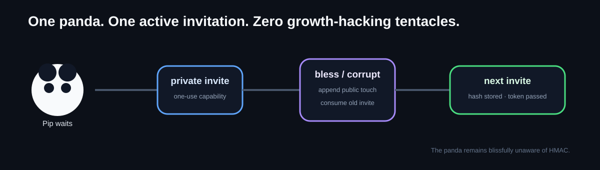

# Relic Zero

**A one-use capability relay for a playful social experiment.**

One participant receives one private invite, changes the relic once, leaves one public touch, and gets exactly one next invite to pass manually. The public core is small on purpose: the interesting part is the capability lifecycle, replay rejection, and event-derived state.



## Relay contract

1. A participant holds the current invite token privately.
2. `Relay.claim()` hashes the supplied token and compares it with the one active invite hash.
3. The action and public text are validated before mutation.
4. The old capability is consumed **before** anything can issue a replacement.
5. One public touch is appended: `sequence`, `actor`, `action`, `message`.
6. Visible state is derived by replaying public touches.
7. One next token is HMAC-derived from the secret, sequence, and previous capability hash; only its hash becomes active state.

A wrong or replayed token is rejected. Invite plaintext is not returned by `publicHistory()`.

## Verify it

```bash
npm test
node --check src/tokens.js
node --check src/text.js
node --check src/evolution.js
node --check src/relay.js
```

The behavior suite is intentionally easy to inspect:

- [`test/relay.test.js`](test/relay.test.js) — seed-once, valid claim, replay rejection, wrong-token rejection, next-token chain, normalization, public-history privacy, and evolution.
- [`test/tokens.test.js`](test/tokens.test.js) — hashing and next-token derivation.
- [`test/text.test.js`](test/text.test.js) — bounded public text/action validation.
- [`test/evolution.test.js`](test/evolution.test.js) — deterministic state replay.

## Review map

| File | What to inspect |
|---|---|
| [`src/relay.js`](src/relay.js) | consume → append → issue-next ordering |
| [`src/tokens.js`](src/tokens.js) | SHA-256 storage hash + HMAC-derived next capability |
| [`src/text.js`](src/text.js) | action and public-text bounds |
| [`src/evolution.js`](src/evolution.js) | state derived from append-only history |
| [`docs/invariants.md`](docs/invariants.md) | properties refactors must preserve |
| [`docs/failure-modes.md`](docs/failure-modes.md) | replay, wrong-token, leak, and divergence failures |
| [`SECURITY.md`](SECURITY.md) | what this public slice does and does not claim |
| [`PROVENANCE.md`](PROVENANCE.md) | what stayed public vs. private |

## Scope

This repository is an **experimental public core**, not a formally audited security protocol and not the full Relic Zero application. It demonstrates the relay semantics in memory. The private project contains persistence, moderation, rendering/UI, analytics, and deployment-specific code that is intentionally not exposed here.

Production use would require additional controls around atomic persistence, secret handling, rate limiting, concurrency, abuse/moderation, and operational recovery; see [`SECURITY.md`](SECURITY.md).

The panda is the premise. The one-use chain is the proof.
