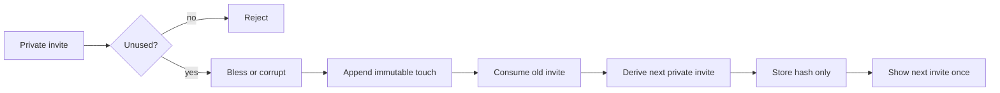

# Relic Zero

**One panda. One-use links. A global chain of tiny moral choices. What could possibly go wrong?**

Relic Zero is the public logic core for a small web experiment: each person receives a private one-use invitation, chooses to bless or corrupt the relic, leaves a short public message, and gets the next one-use invitation to pass manually.

No accounts. No chat. No automatic messages. No growth-hacking tentacles.

## Relay



The public history can be replayed to derive the relic's visible state. The private invite itself is not part of that history.

## What this proves

- one-use capability tokens;
- token hashes instead of plaintext storage;
- deterministic next-token derivation;
- immutable event replay;
- bless/corrupt state aggregation;
- duplicate-claim rejection;
- no automatic forwarding.

## Run

```bash
npm test
```

## Example

```js
import { Relay } from "./src/relay.js";

const relay = new Relay({ secret: "dev-secret-change-me" });
const first = relay.seed();

const result = relay.claim(first, {
  actor: "Ada",
  action: "bless",
  message: "please behave"
});

console.log(result.publicTouch);
console.log(result.nextInvite); // shown once by the caller; never stored plaintext
```

## Boundary

This is the relay/state core, not the full private app. There is no production secret, database, moderation console, analytics, payment, login, or deployment config in this repo.

## Provenance

Sanitized and rewritten from my private `relic-zero-v1` experiment. The private project also contains the browser UI, Three.js relic renderer, SQLite persistence, moderation tooling, and stress views.
