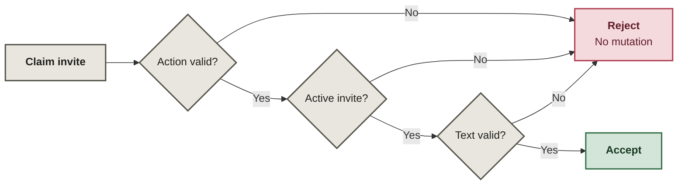
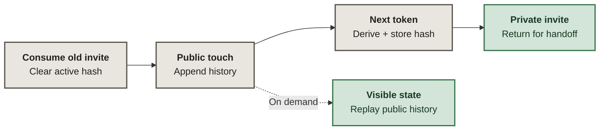

# Relic Zero

A one-use capability relay: claim a private invite, leave a bounded public touch, and receive the next invite for manual handoff.

**Yes, the relic is a panda. The capability chain is less forgiving.**

This public sample comes from my private Relic Zero experiment. It exposes the relay and state rules; I can build and adapt the surrounding interactive experience, persistence, moderation, and application integrations.

## Validation: refuse before the first mutation

`Relay.claim()` requires `bless` or `corrupt`, matches the invite's SHA-256 against the active hash, then normalizes and bounds the actor/message. Wrong or replayed invites and invalid inputs exit before consuming the capability.

## Advancement: consume before issuing the next invite

The accepted claim clears the old capability, appends a public touch, derives the next token with HMAC, stores its hash, then returns the private invite. `evolution()` separately replays public history on demand. Invite plaintext never enters that history.

## Relay contract

`Relay.claim()` preserves four useful properties:

- **Refuse before mutation.** Invalid actions, wrong/replayed invites, and invalid public text fail before the active capability is consumed.
- **Consume before issue.** The old capability is cleared before the public touch is appended and before the next capability is derived.
- **One public history, one private chain.** Public touches contain `sequence`, `actor`, `action`, and `message`; invite plaintext stays out of that history.
- **Derive visible state.** `evolution()` replays append-only touches instead of maintaining a second mutable counter.

## Files worth opening

| File | What it shows |
|---|---|
| [`src/relay.js`](src/relay.js) | The claim lifecycle and mutation order |
| [`src/tokens.js`](src/tokens.js) | SHA-256 capability hashes and HMAC next-token derivation |
| [`src/text.js`](src/text.js) | Action validation and bounded public text |
| [`src/evolution.js`](src/evolution.js) | Visible state derived from public history |
| [`test/relay.test.js`](test/relay.test.js) | Replay/wrong-token refusal, normalization, privacy, and chain advancement |
| [`SECURITY.md`](SECURITY.md) | Security claims this experiment explicitly does not make |

Verification commands and expected checks: [`docs/verification.md`](docs/verification.md).

## Scope

This repository is an **experimental public core**, not a formally audited security protocol and not the full Relic Zero application. It demonstrates the relay semantics in memory. The private project contains persistence, moderation, rendering/UI, analytics, and deployment-specific code that is intentionally not exposed here.

Production use would require additional controls around atomic persistence, secret handling, rate limiting, concurrency, abuse/moderation, and operational recovery; see [`SECURITY.md`](SECURITY.md).
