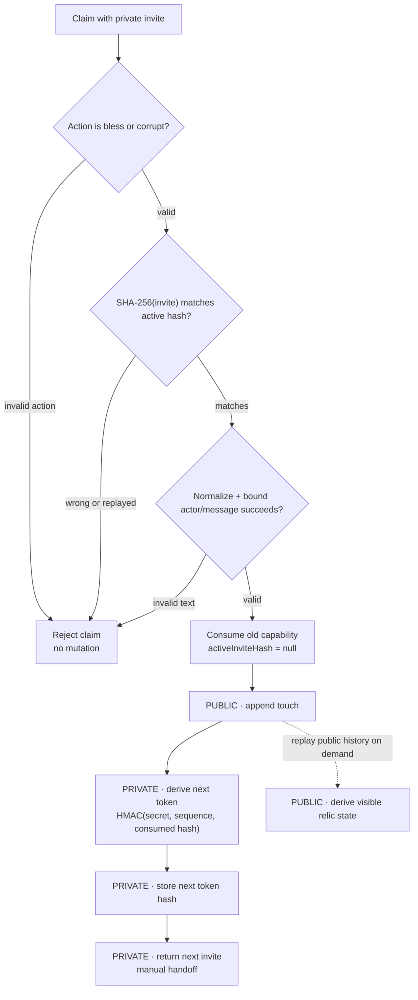

# Relic Zero

**A one-use capability relay for a small social experiment.**

A participant receives one private invite, uses it once, appends one bounded public touch, and receives exactly one next invite to hand off manually. This public slice keeps the mechanism small enough to inspect: replay rejection, private/public separation, and visible state derived from append-only history.

The refusal branches all exit before the first mutation. Invite plaintext never enters public history; only the active invite hash is stored as capability state.

## Relay contract

`Relay.claim()` preserves four useful properties:

- **Refuse before mutation.** Invalid actions, wrong/replayed invites, and invalid public text fail before the active capability is consumed.
- **Consume before issue.** The old capability is cleared before the public touch is appended and before the next capability is derived.
- **One public history, one private chain.** Public touches contain `sequence`, `actor`, `action`, and `message`; invite plaintext stays out of that history.
- **Derive visible state.** `evolution()` replays append-only touches instead of maintaining a second mutable counter.

## Files worth opening

| File | What it shows |
|---|---|
| [`src/relay.js`](src/relay.js) | The claim lifecycle and mutation order |
| [`src/tokens.js`](src/tokens.js) | SHA-256 capability hashes and HMAC next-token derivation |
| [`src/text.js`](src/text.js) | Action validation and bounded public text |
| [`src/evolution.js`](src/evolution.js) | Visible state derived from public history |
| [`test/relay.test.js`](test/relay.test.js) | Replay/wrong-token refusal, normalization, privacy, and chain advancement |
| [`SECURITY.md`](SECURITY.md) | Security claims this experiment explicitly does not make |

Verification commands and expected checks: [`docs/verification.md`](docs/verification.md).

## Scope

This repository is an **experimental public core**, not a formally audited security protocol and not the full Relic Zero application. It demonstrates the relay semantics in memory. The private project contains persistence, moderation, rendering/UI, analytics, and deployment-specific code that is intentionally not exposed here.

Production use would require additional controls around atomic persistence, secret handling, rate limiting, concurrency, abuse/moderation, and operational recovery; see [`SECURITY.md`](SECURITY.md).

Yes, the relic is a panda. The capability chain is less forgiving.
